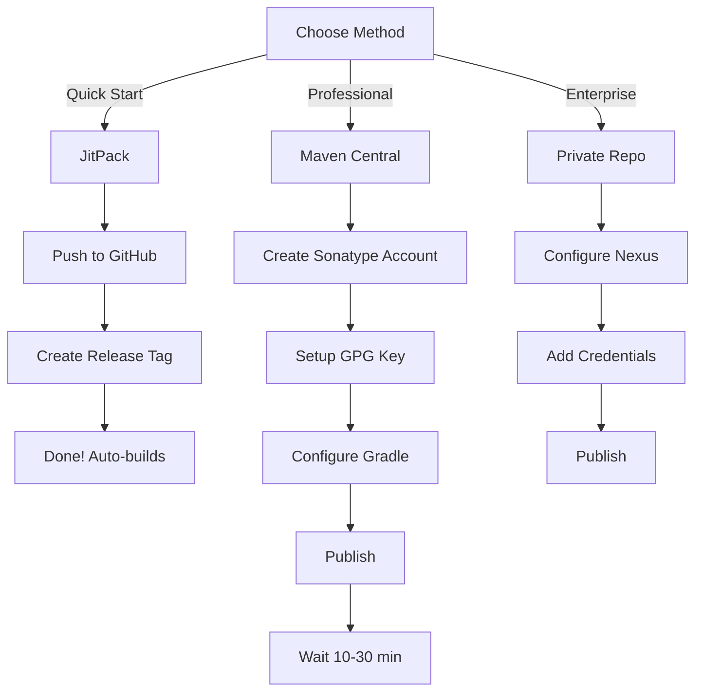

# Vibe - Android Network Package

A comprehensive, production-ready Android network handling library built with Kotlin and Jetpack Compose.

## 📦 Project Overview

This project contains a complete Android networking package with all necessary tools for building, testing, and publishing as a library.

### What's Inside

```
vibe/
├── android_network_package/      ← The actual library
│   ├── network/                  ← HTTP client, services, interceptors
│   ├── data/                     ← Models and repositories
│   ├── ui/                       ← ViewModels and Composables
│   ├── build.gradle.kts          ← Configured for publishing
│   ├── README.md                 ← Package documentation
│   ├── INTEGRATION_GUIDE.md       ← How to use the package
│   └── PUBLISHING_GUIDE.md        ← Advanced publishing setup
│
├── BUILD_AND_PUBLISH.md          ← START HERE (step-by-step)
├── PUBLISHING_SUMMARY.md         ← Overview of what's included
├── PUBLISHING_CHEAT_SHEET.md     ← Quick reference commands
├── PUBLISHING_METHODS.md         ← Comparison of publishing options
│
└── .github/
    └── workflows/
        └── publish.yml           ← GitHub Actions automation
```

## 🚀 Quick Start

### 1. Choose Your Publishing Method

| Method | Time | Best For |
|--------|------|----------|
| **JitPack** | 5 min | Quick start, learning |
| **Maven Central** | 30 min | Production, open source |
| **Private Repo** | 20 min | Enterprise, internal |

### 2. Follow the Guide

**→ Open `BUILD_AND_PUBLISH.md` and choose your method**

It contains step-by-step instructions for:
- JitPack (easiest)
- Maven Central (professional)
- Private repositories

### 3. Build and Publish

```bash
# Build locally first
cd /Users/danhphamquoc/bitbucket/vibe
./gradlew :android_network_package:build

# Then follow the guide for your chosen method
```

## 📚 Documentation Guide

### For Different Use Cases

**"I want to publish ASAP"**
→ Read: `PUBLISHING_CHEAT_SHEET.md`

**"I want step-by-step instructions"**
→ Read: `BUILD_AND_PUBLISH.md`

**"I want to compare methods"**
→ Read: `PUBLISHING_METHODS.md`

**"I want to use the package in my app"**
→ Read: `android_network_package/INTEGRATION_GUIDE.md`

**"I want advanced configurations"**
→ Read: `android_network_package/PUBLISHING_GUIDE.md`

**"I want to understand the package"**
→ Read: `android_network_package/README.md`

## 🎯 Publishing Flow (Recommended)



## 💻 Development Environment

### Requirements
- Java 11+
- Android SDK (API 24+)
- Gradle 8.0+
- Kotlin 1.9.23+

### Setup

```bash
# Clone the repository
cd /Users/danhphamquoc/bitbucket/vibe

# Build the package
./gradlew clean :android_network_package:build

# Run tests
./gradlew :android_network_package:test

# Check for lint errors
./gradlew :android_network_package:lint
```

## 📋 Key Features

### Network Layer
- ✅ Retrofit + OkHttp integration
- ✅ Kotlin coroutines support
- ✅ Authentication interceptor
- ✅ HTTP logging interceptor
- ✅ Custom timeout configuration

### Data Layer
- ✅ Repository pattern implementation
- ✅ Kotlinx Serialization support
- ✅ Type-safe Result<T> handling
- ✅ Proper error handling

### UI Layer
- ✅ Jetpack Compose integration
- ✅ ViewModel with StateFlow
- ✅ Loading/Error UI components
- ✅ Pre-built composables

### Publishing
- ✅ Maven Central support
- ✅ JitPack support
- ✅ Private repository support
- ✅ GitHub Actions automation
- ✅ ProGuard rules included

## 🔄 Typical Workflow

### 1. Customize the Package
```bash
# Edit android_network_package/build.gradle.kts
# Update version, group ID, and metadata
```

### 2. Build Locally
```bash
./gradlew :android_network_package:build
```

### 3. Test
```bash
./gradlew :android_network_package:test
```

### 4. Publish
```bash
# Choose one method from BUILD_AND_PUBLISH.md

# Method 1: JitPack
git tag v1.0.0 && git push origin v1.0.0

# Method 2: Maven Central
./gradlew :android_network_package:publishReleasePublicationToSonatypeRepository

# Method 3: Private Repo
./gradlew :android_network_package:publish
```

### 5. Verify
```bash
# Verify your package is accessible
# See PUBLISHING_METHODS.md for verification steps
```

## 📝 Common Tasks

### Build Commands

```bash
# Clean build
./gradlew clean :android_network_package:build

# Build with debug info
./gradlew :android_network_package:build -i

# Run tests
./gradlew :android_network_package:test

# Check lint
./gradlew :android_network_package:lint

# Build and run tests
./gradlew :android_network_package:build :android_network_package:test
```

### Publishing Commands

```bash
# Publish to local Maven (test)
./gradlew :android_network_package:publishToMavenLocal

# Publish to Maven Central
./gradlew :android_network_package:publishReleasePublicationToSonatypeRepository

# Publish to private repository
./gradlew :android_network_package:publish

# Full Maven Central with staging
./gradlew clean \
  :android_network_package:build \
  :android_network_package:publishReleasePublicationToSonatypeRepository \
  publishToSonatype \
  closeAndReleaseSonatypeStagingRepository
```

## 🔐 Security & Credentials

### For Maven Central

Create `~/.gradle/gradle.properties`:

```properties
# Sonatype credentials
ossrhUsername=YOUR_SONATYPE_USERNAME
ossrhPassword=YOUR_SONATYPE_PASSWORD

# GPG signing
signing.keyId=YOUR_GPG_KEY_ID
signing.password=YOUR_GPG_PASSWORD
signing.secretKeyRingFile=/Users/yourusername/.gnupg/secring.gpg
```

### Environment Variables

```bash
export OSSRH_USERNAME="your_username"
export OSSRH_PASSWORD="your_password"
export GPG_PASSPHRASE="your_passphrase"
export GPG_KEY_ID="your_key_id"
```

## 📦 Using the Published Package

### From JitPack

```gradle
repositories {
    maven { url = uri("https://jitpack.io") }
}

dependencies {
    implementation("com.github.YOUR_USERNAME:vibe:v1.0.0")
}
```

### From Maven Central

```gradle
dependencies {
    implementation("io.github.yourusername:android-network-package:1.0.0")
}
```

### From Private Repository

```gradle
repositories {
    maven {
        url = uri("https://your-nexus.com/repository/android/")
        credentials {
            username = "username"
            password = "password"
        }
    }
}

dependencies {
    implementation("com.company:android-network-package:1.0.0")
}
```

## 🐛 Troubleshooting

### Build Issues

**Problem**: Gradle sync fails
```bash
# Solution
./gradlew clean
./gradlew sync
```

**Problem**: Dependency not found
```bash
# Solution: Check repositories block in build.gradle.kts
# Ensure google() and mavenCentral() are included
```

### Publishing Issues

**Problem**: Authentication failed
```bash
# Check credentials
cat ~/.gradle/gradle.properties

# Verify Sonatype account is active
# https://s01.oss.sonatype.org
```

**Problem**: GPG key not found
```bash
# Re-export GPG key
gpg --export-secret-keys > ~/.gnupg/secring.gpg
```

**Problem**: Library not appearing on Maven Central
```bash
# Wait 10-30 minutes for sync
# Check staging repository in Sonatype portal
# Verify POM metadata is complete
```

## 📊 Project Statistics

- **Language**: Kotlin
- **Min SDK**: API 24 (Android 7.0)
- **Target SDK**: API 34 (Android 14)
- **Build Tool**: Gradle 8.0+
- **Dependencies**: Retrofit, OkHttp, Kotlinx Serialization, Jetpack Compose
- **License**: MIT

## 🔗 Useful Links

- [JitPack](https://jitpack.io/)
- [Maven Central Repository](https://central.sonatype.com/)
- [Sonatype Portal](https://s01.oss.sonatype.org/)
- [Gradle Documentation](https://docs.gradle.org/)
- [Android Library Documentation](https://developer.android.com/studio/projects/android-library)
- [Retrofit Documentation](https://square.github.io/retrofit/)
- [Jetpack Compose](https://developer.android.com/jetpack/compose)

## 📞 Support

- **Setup help?** → See `BUILD_AND_PUBLISH.md`
- **Quick reference?** → See `PUBLISHING_CHEAT_SHEET.md`
- **Method comparison?** → See `PUBLISHING_METHODS.md`
- **Integration help?** → See `android_network_package/INTEGRATION_GUIDE.md`
- **Package documentation?** → See `android_network_package/README.md`

## 📄 License

MIT License - See `android_network_package/LICENSE` for details

## 🎯 Next Steps

1. Read `BUILD_AND_PUBLISH.md` for your chosen publishing method
2. Customize `android_network_package/build.gradle.kts`
3. Build: `./gradlew :android_network_package:build`
4. Publish using your chosen method
5. Use the published package in your projects

---

**Ready to publish?** → Open `BUILD_AND_PUBLISH.md` and choose your method!
